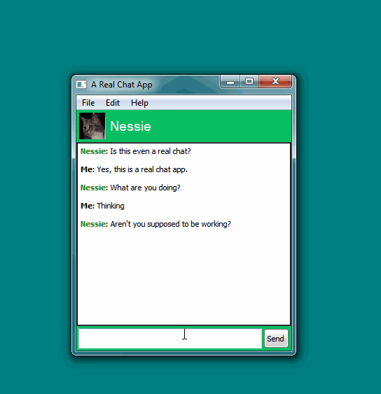

# Coverapp

A simple application that covers a part of your screen and uncovers automatically
when your mouse moves over it. Handy for hiding personal or sensitive chats when
someone comes to talk to you at your desk.

Created with Qt 5.
